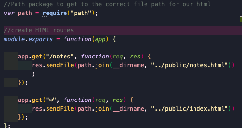
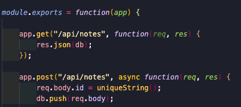
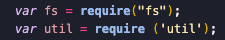
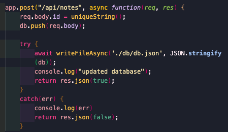
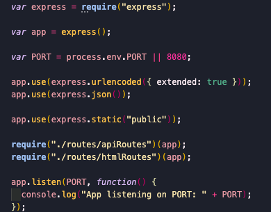
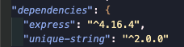
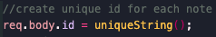
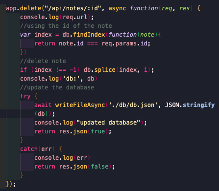

# noteTaker

This app allows the user to create new notes, save them and delete them as the user pleases. 

1. Created HTML & API routes that returns the html files

    

    

2. Used fs module to store and retrieve notes

    

    

3. Created a server.js file to create an event listener for the PORT

    

4. Installed unique-string npm package to add a unique id to each note

    

    

5. Used the unique id to delete the notes

    
